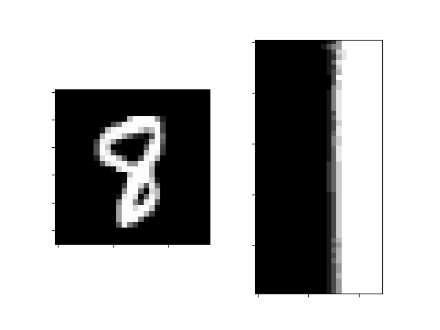
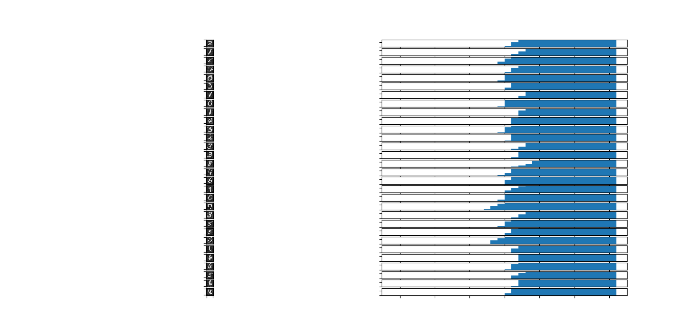

# group_invariant_kernels
Group Invariant Kernels, based on Learning with Group Invariant Features by Youssef Mroueh, et al.

This one calculates a bunch of histograms of random transformations of random samples to simulate a Harr Integrated Group Invariant Kernel function.

It's easier to say that it transforms the random sample in a invertible manner, calculates a PDF of the dot product and the input over a range from [-1,1].

Really neat stuff!
